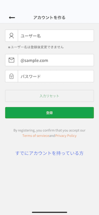
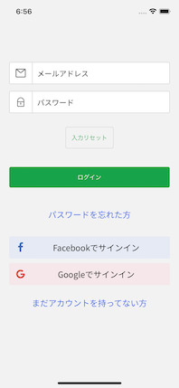

# 主な使用技術

- NativeBase 
- TypeScript 
- Expo 
- firebase
- Redux

| 使用技術 | version |
| --- | --- |
| NativeBase| 3.4.0| 
| Expo| 47.0.0| 
| firebase |9.14.0| 
| react-redux |8.0.5| 

# main
## Feed


## Creator Page


## Event Page


# Edit/Remove


# Sign up/in



# Create


-------------------------------------------------------------
<br>

# コミットメッセージ
| 記号 | Description | 
| --- | --- |
| :white_check_mark:| 小さな修正など完了、特にエラーなし|
| :wrench: | 修正中/作業中 | 
| :tada: | 大きめの修正完了 | 


# Warning
高さに問題がある時もしかすると以下の出力結果が0になっているかもしれません。
```js
console.log(Constants.statusBarHeight);
```
その場合はreloadしてください。

# Branch
## main
メインブランチ

## dev
作業中ブランチ

## v1
NativeBase docsから作られたアプリにeslintとprettierを加えただけのスッピンの状態

## v2
デザイン部分完了　(firebase、Redux追加前)

## v3
firebaseのAuthentication部分を実装（SignupPage、LogoutPage、LoginPage）

## v3.1
引き続きfirebaseでの実装(途中まで)。
すべてをfirebaseベースで実装しようと思いましたがReduxで管理をしたくなったので途中でv4に切り替えてます。
また随時v3ブランチに戻ってfirebaseでの実装をすすめようかな、と思います。

## v4
Redux と firebase と useContext で実装している。
- SearchPageは保留

## v4.1
- Delete機能追加
- Reload機能追加


## v4.2
- ログイン/サインアップの機能改良
- デザインを更新
- イベントページ追加
など。


## v4.3
- レンダリングの問題を解決<br>
▼修正前:<br>
期待通りにレンダリングがされない<br>
この例でいくとhisokaのページに移ってもhisokaのデータを使って再レンダリングがされていない。<br>
※手動で更新をすると強制レンダリングされるので期待通りにはなる<br>


▼修正後:<br>
`useState`を使用しfirebaseからfetchしてきたデータを一旦ストアさせ、そのストアデータを使うことで毎回stateが変わるたびにレンダリングが走るようにしてみた。

`Profile.tsx`から一部抜粋:
```jsx
  const POSTS = useAppSelector((state) =>
    selectPostsByCreator(state, item.creatorId)
  );

  const [posts, setPosts] = useState<Post[]>([]);

  useEffect(() => {
    dispatch(fetchAllPosts());
    setPosts(POSTS);
  }, [dispatch]);//ここでdependenciesにPOSTSを加えてしまうとレンダリングが永遠繰り返されてしまう
```
上記のようにすることでPOSTSが変わるたびに(ステートが変わり)毎回レンダリングが走るので期待通りデータが更新されるようになった。<br>


しかし、パフォーマンスに難あり<br>
以下のようにuseEffectが最低3回走る。不必要なレンダリングがちょくちょく起こるため実用には不向き。


### Asides:
>Generally speaking, using setState inside useEffect will create an infinite loop that most likely you don't want to cause. There are a couple of exceptions to that rule which I will get into later.<br>
>useEffect is called after each render and when `setState` is used inside of it, it will cause the component to re-render which will call `useEffect` and so on and so on.<br>
>One of the popular cases that using `useState` inside of `useEffect` will not cause an infinite loop is when you pass an empty array as a second argument to `useEffect` like `useEffect(() => {....}, [])` which means that the effect function should be called once: after the first mount/render only. This is used widely when you're doing data fetching in a component and you want to save the request data in the component's state.[^1]

以下のように書き換えることで解決
```jsx
  useEffect(() => {
    dispatch(fetchAllPosts());
    // setPosts(POSTS);
  }, [dispatch]);

  useEffect(() => {
    setPosts(POSTS);
  }, []);//<-----第二引数がemptyだったら無限ループは回避できる
```


## v5　(予定)
SearchPageを実装


[^1]:https://stackoverflow.com/questions/53715465/can-i-set-state-inside-a-useeffect-hook